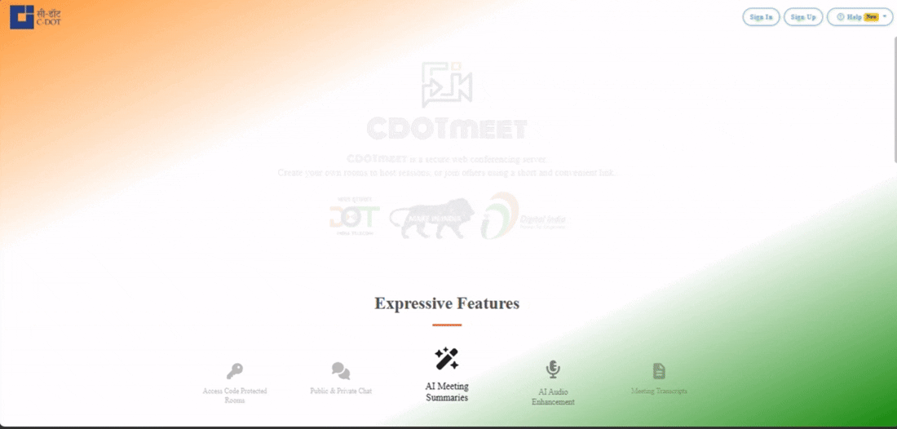
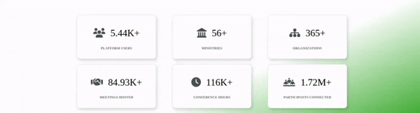
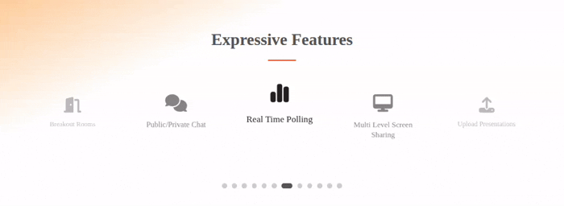
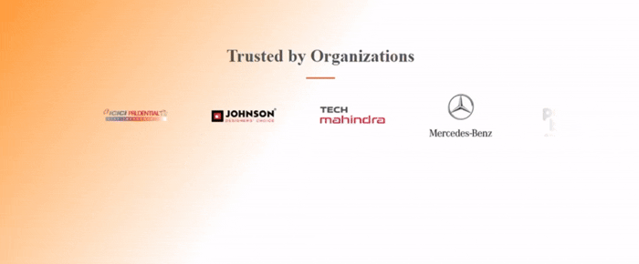

#  CDOT Meet — Frontend UI

A landing page for **CDOT Meet**, a government video conferencing platform, built with React.js using a modular, component-based architecture.

---

##  Features

###  Landing Page Development
Built the landing page for CDOT Meet using **React.js** with a modular, component-based structure.



---

###  Dynamic Data Rendering & API Integration
Developed a dynamic **Stats Section** (Active Users, Total Meetings, Total Duration, Meeting Attendees) integrated with **React Query** to fetch live data from the API. Used **React Intersection Observer** to trigger data loading on scroll, with **Skeleton Loaders** for smooth loading states.




---

###  Feature Showcase Section
Built an interactive **3D card** using **Embla Carousel** with autoplay, displaying key platform features using **Font Awesome** icons in a clean, responsive layout.




---

###  Organizations Showcase
Built a seamless **auto-scrolling logo marquee** to highlight trusted organizations across India, using **React Bootstrap** for a clean, continuously animated display.




---

## Technologies Used

- React
- React Bootstrap
- React Query
- Embla Carousel
- Framer Motion
- React Icons
- React Intersection Observer
---

##  Project Structure

```
src/
├── Website Stats/
│   ├── WebsiteStats.jsx
│   ├── StatsCard.jsx
│   ├── StatsCardPlaceholder.jsx
│   └── website_counter.css
│
├── Brand Slider/
│   ├── BrandSlider.jsx
│   └── slider.scss
│
├── Expressive Feature/
    ├── ExpressiveFeaturesSlider.jsx
    └── expressive_features_slider.css
```

---

##  Installation & Setup

**1. Clone the repository**
```bash
git clone https://github.com/raut-anuj/InternshipProject.git
cd InternshipProject
```

**2. Install dependencies**
```bash
npm install
```

**3. Install additional packages** (if not already installed)
```bash
npm install framer-motion@6.5.1
npm install react-intersection-observer@10.0.3
npm install embla-carousel-react@8.6.0 embla-carousel-autoplay@8.6.0
```

**4. Run the project**
```bash
npm run dev
```

---

## Author

**Anuj Raut**  
GitHub: [@raut-anuj](https://github.com/raut-anuj)
